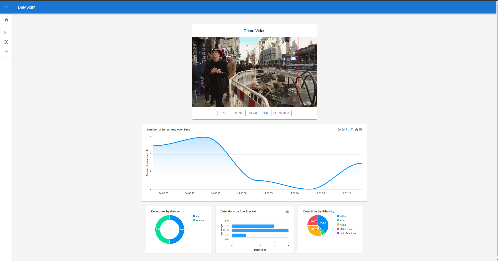
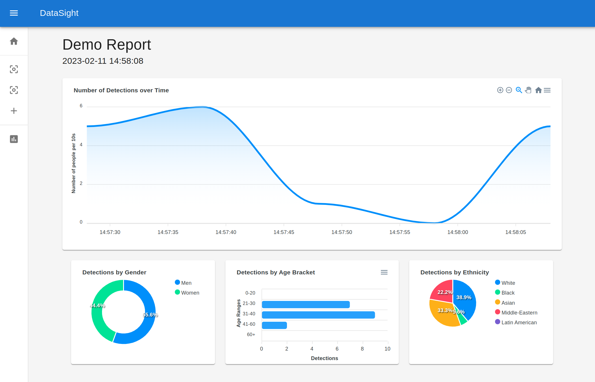

# DataSight
DataSight is a platform that detects, tracks, and infers individuals' age and gender in real-time for data collection and visualisation in industries such as retail. I'm in the process of migrating the backend to python with flask to make it possible to have an unlimited number of 'camera nodes' linked to an account distrubted on external devices.

## Features
- Real-time data visualization with Full-Stack Application 
- Lightweight computer vision algorithm with face-detection with age and gender estimation using system webcam

## Screenshots

  
  

## Technology Stack:
DataSight has been developed using the following technologies:

- React
- Material UI
- Node.js
- Express
- MongoDB
- Python
- Flask
- OpenCV
- TensorFlow
- Numpy
- Keras

## Installation
To set up DataSight, follow these steps:

Clone this repository to your local machine using the following command:

`$ git clone https://github.com/<username>/DataSight.git`

Navigate to the project directory:

`$ cd DataSight`

Install the required dependencies using the following command, in the directories 'server' and 'my-app':

`$ npm install`

Start the application by running the following commands in the 'server' and 'my-app' directories respectively:

`$ node index.js`

`$ npm start`

Usage

To use DataSight, simply navigate to http://localhost:3000 in your browser.

## Contributing

We welcome contributions to DataSight! To contribute, please follow these steps:

- Fork this repository to your own account.
- Clone the repository to your local machine.
- Create a new branch for your changes.
- Make your changes and commit them to your branch.
- Push the changes to your fork.
- Submit a pull request to this repository.

## License
DataSight is licensed under the MIT License.
